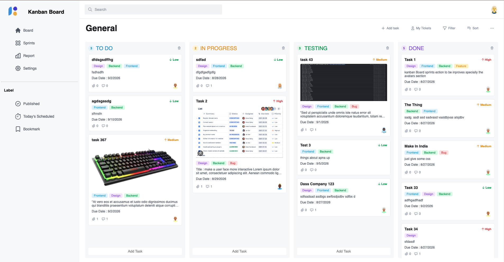
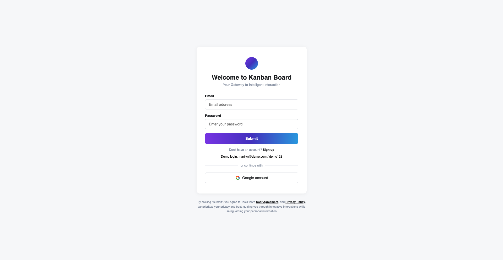
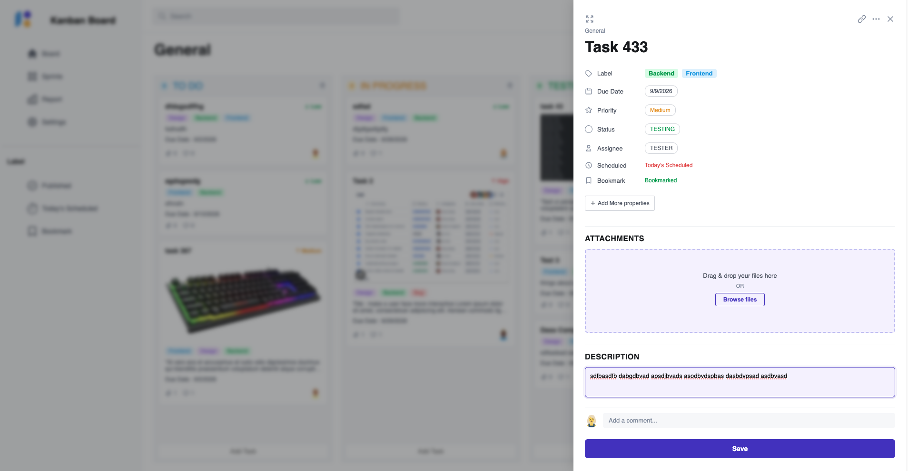
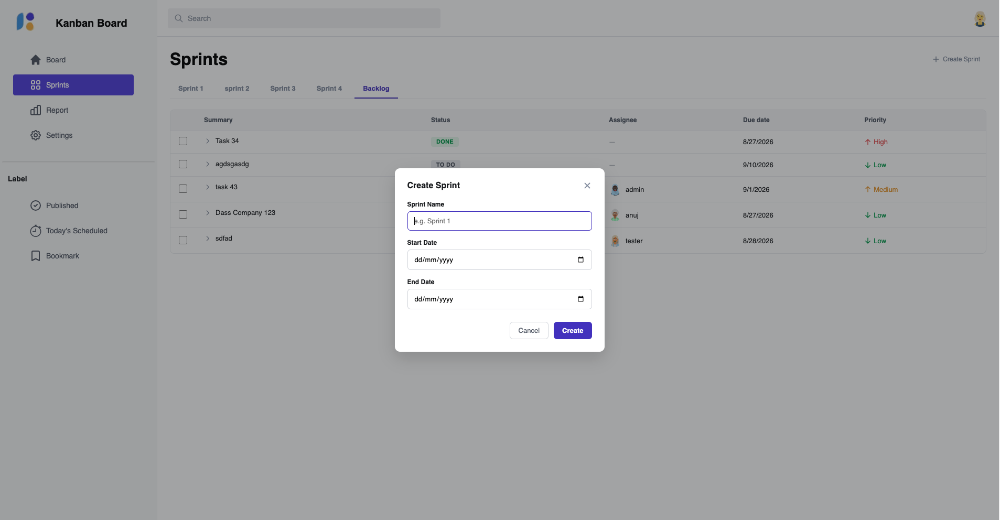
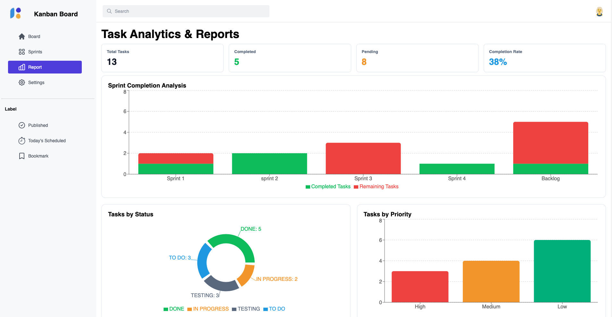
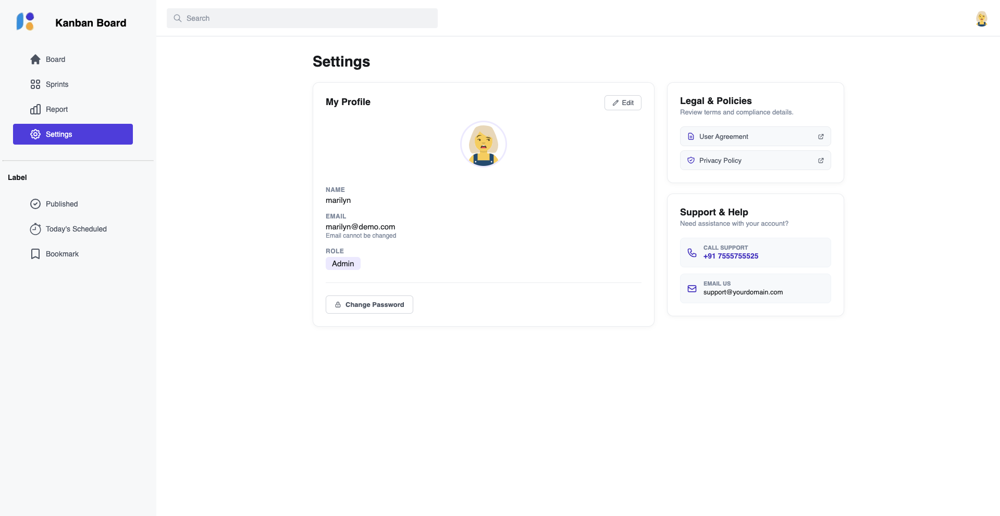
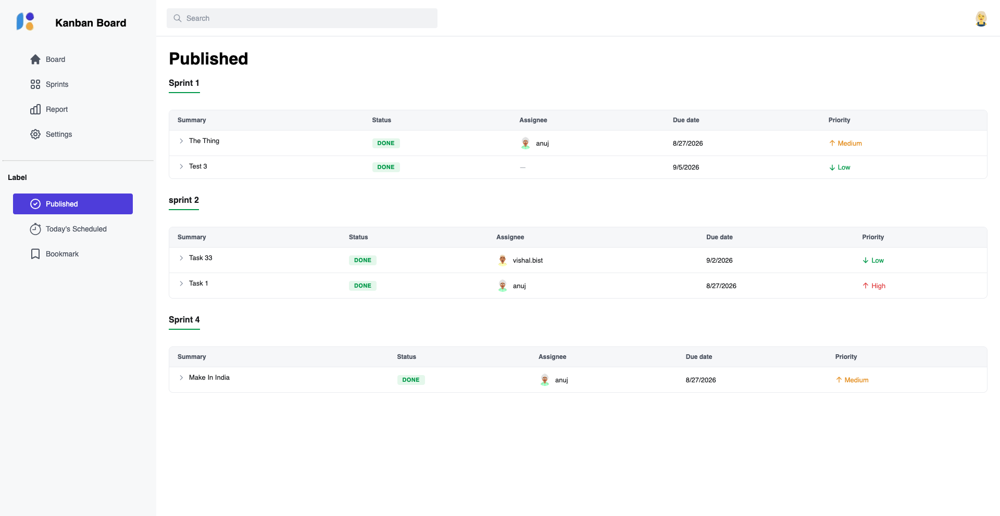
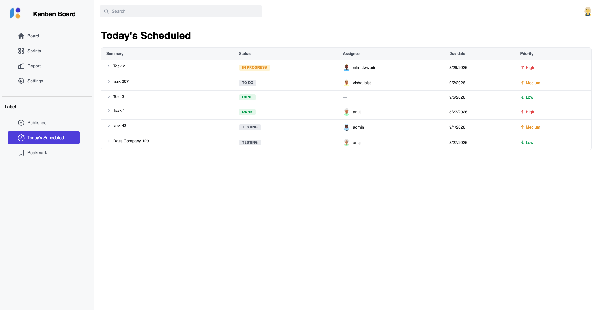

# Kanban Board

A full-featured, real-time Kanban board application built with React and Firebase. Manage tasks across customizable columns, organize work into sprints, collaborate with threaded comments, and track progress with built-in analytics — all synced live across devices.

##  Live Demo
[View the live application](https://kanban-board-ys9h.vercel.app/)

## Board


## Features

### Authentication
- Email/password Sign Up and Login powered by Firebase Authentication
- Persistent sessions via Firebase Auth state
- Editable user profile (name, avatar) with secure password change (re-authentication required)
- Role-based access — restricted users see only tasks assigned to them; admins get full board access
- Shareable invite flow for onboarding new team members

### Task Management
- Create, edit, and delete tasks with a rich task modal
- Task fields: name, description, due date, priority (High/Medium/Low), status, labels (multi-select, color-coded), assignee, attachments, and comments
- "Today's Scheduled" and "Bookmark" flags for quick access from the sidebar
- Field validation before saving (required fields enforced)
- Shareable direct links to individual tasks (`/task/:taskId`)
- File attachments with image previews and a full-screen lightbox viewer

### Kanban Board
- Drag-and-drop tasks between and within columns (powered by `@dnd-kit`)
- Smooth drag overlay with position-aware reordering (`order` field per task)
- Dynamic, user-defined columns — add, rename, delete, and reposition columns
- Deleting a column removes its tasks; deleting task fields cleans up related data
- Search/filter tasks by name or description
- Filter tasks by assignee and sort by priority

### Sprints & Backlog
- Create sprints with name, start date, and end date
- Assign tasks to sprints or leave them in the Backlog
- Table view of tasks per sprint/backlog with inline status, assignee, due date, and priority
- Remove tasks from a sprint (returns them to Backlog)
- Deleting a sprint automatically returns its tasks to the Backlog

### Comments
- Threaded, tree-style comments with unlimited nested replies
- Like/unlike comments and replies
- Recursive rendering with visual indentation per depth level

### Reports & Analytics
- Live dashboard with key metrics: total tasks, completed, pending, completion rate
- Status breakdown (pie chart) and priority breakdown (bar chart) via Recharts
- Auto-updates as tasks change (memoized calculations for performance)

### Sidebar Views
- **Published** — tasks marked as Done
- **Today's Scheduled** — tasks flagged for today
- **Bookmarks** — tasks the user has bookmarked
- Collapsible, responsive sidebar for mobile and tablet

### UX & Design
- Custom alert/toast system (replaces native browser alerts) via React Context
- Responsive layout — toolbar actions collapse into a mobile dropdown menu on small screens
- Blurred, locked-out view of the board for logged-out visitors with a call-to-action overlay
- Hidden scrollbars with preserved scroll functionality on board columns and modals

## Tech Stack

| Category | Technology | Version |
|---|---|---|
| Frontend | React (Vite) | 19.2.8 |
| Routing | React Router | 7.18.2 |
| Backend / Database | Firebase Authentication, Firebase Firestore (real-time) | 12.18.0 |
| Drag & Drop | @dnd-kit/core, @dnd-kit/sortable | 6.3.1 |
| Charts | Recharts | 3.10.1 |
| Icons | react-icons | 5.7.0 |
| Validation | Zod | 4.4.3 |
| Styling | Plain CSS (component-scoped stylesheets) |  |

## Getting Started

### Prerequisites
- Node.js (v18 or higher recommended)
- A Firebase project with **Authentication** (Email/Password provider) and **Firestore Database** enabled

### Installation

```bash
git clone https://github.com/anuj-tiwari-iphtech/Kanban-Board.git
cd Kanban-Board
npm install
```

### Firebase Setup

1. Create a project at [Firebase Console](https://console.firebase.google.com/)
2. Enable **Authentication → Sign-in method → Email/Password**
3. Create a **Firestore Database** (start in test mode for development)
4. Copy your Firebase config into `src/Firebase/firebase.js`:

### Running Locally

```bash
npm run dev
```

The app will be available at `http://localhost:5173`.

To test on another device on the same network:

```bash
npm run dev -- --host
```

Then open the printed **Network** URL from a device on the same Wi-Fi.

### Building for Production

```bash
npm run build
```

## Folder Structure

```
src/
├── assets/                  # Static images and avatars
├── auth/                    # AuthContext, user hooks
├── components/
│   ├── AddTaskModal/        # Task modal, comments, attachments, description
│   ├── AlertModal/          # Custom alert/toast system + context
│   ├── KanbanBoard/         # Board, columns, cards, drag-and-drop logic
│   ├── ProfileCard/         # User profile view/edit
│   ├── Report/              # Analytics charts and KPIs
│   ├── TaskTable/           # Table view used in Sprints/Backlog/Bookmarks
│   └── navbar/ sidebar/     # App shell navigation
├── customHooks/             # useClickOutside, useLocalStorage
├── Firebase/                 # Firebase config, useFirestoreCollection hook
├── pages/                   # Route-level pages (General, Board, Report, Setting, etc.)
├── Sprints/                 # Sprint creation and task-assignment modals
└── routes/                  # App route definitions
```

## Data Model (Firestore Collections)

| Collection | Description |
|---|---|
| `users` | User profiles (name, email, avatar, role) |
| `tasks` | Task documents — includes `status`, `priority`, `labels`, `assignee`, `sprintId`, `order`, etc. |
| `columns` | Board columns — `title`, `color`, `position` |
| `sprints` | Sprint metadata — `name`, `startDate`, `endDate` |

## License

This project is for educational/personal use. Add a license of your choice if distributing publicly.

# ScreenShots

## Login Page


## Add Task Modal


## Sprints Page


## Report Page


## Setting Page


## Published Page


## Today Scheduled Page
